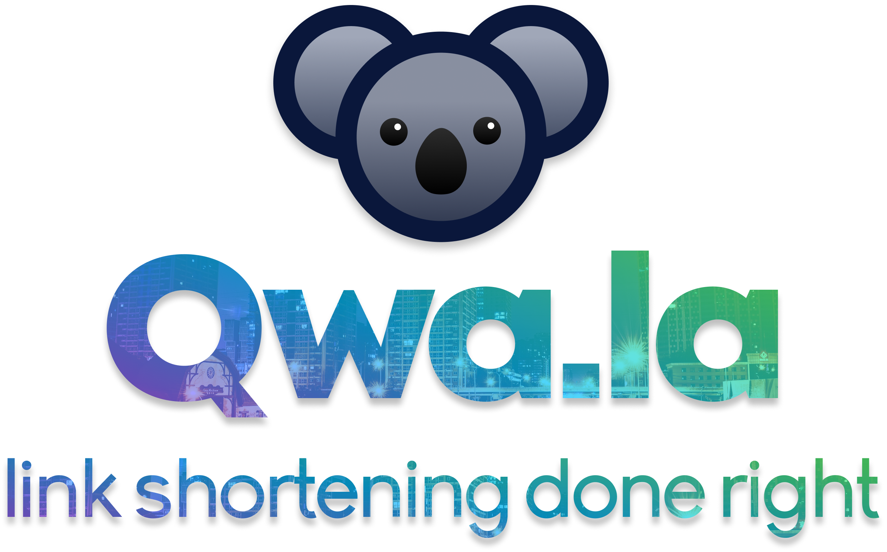

<a href="https://qwa.la"></a>

<div style="text-align: center; margin: 20px 0px 30px">  </div>

**Qwa.la is a simple, free, powerful link shortener.** It was built out of a
discontent with existing options—some required accounts for more powerful
features, while others featured unnappealing designs and were unpleasant to
use. Qwa.la solves these problems, making it a great, go-to solution for link
shortening. There aren't any features behind a pay wall, and there are no ads.
And it's open source!

## Get Started

Qwa.la is **written entirely in JavaScript**, so as long as you have Node.js
installed, it should be easy to get the server up and running. For our
database, we use Firebase's **Cloud Firestore**, and for HTML templating we use
**Handlebars**.

Once you've cloned the repository, there are a few things to configure:

 - `server/config/firebaseServiceKey.json`: This file is used for Firebase
   authentication. You should replace the placeholder credentials here with your
   own Firebase information. You can read more about this process
   [in the Firebase docs](https://firebase.google.com/docs/admin/setup#add_firebase_to_your_app).
 - `server/config/settings.json`: This file hold basic customization settings
   to change the functionality of the app. Most of these are pre-filled with
   reasonable defaults, but you can edit them if you want.
 - `web/static/js/src/config.js`: This file also holds basic configuration, but
   for the frontend.

Once you have your configuration setup, you should be able to do a simple

```bash
npm install
npm start
```

to start the server! :tada:

## More Qwa.la

Qwa.la offers numerous other methods of link shortening which are all listed below.

 - **JavaScript Library**: The Qwa.la JS library provides easy access to the
   Qwa.la link shortening features. Find it
   [on GitHub](https://github.com/qwamber/qwala-js) or read the
   [full documentation](https://qwa.la/js-library).

 - **Web API**: The Qwa.la web API exposes public Qwa.la functionality through
   HTTP requests. Read the [documentation](https://qwa.la/web-api) to get
   started.

 - **Mobile App**: Qwa.la has a mobile app powered by React Native. Find it
   [on GitHub](https://github.com/qwamber/qwala-mobile).

 - **Telegram Bot**: Qwa.la has a Telegram bot in order to make link shortening
   quick and easy for Telegram users. Read the
   [documentation](https://qwa.la/telegram-bot) or find it find it
   [on GitHub](https://github.com/qwamber/qwala-telegram).

 - **Discord Bot**: Qwa.la has a Telegram bot in order to make link shortening
   quick and easy for Discord users. Read the
   [documentation](https://qwa.la/discord-bot) or find it find it
   [on GitHub](https://github.com/qwamber/qwala-discord).
